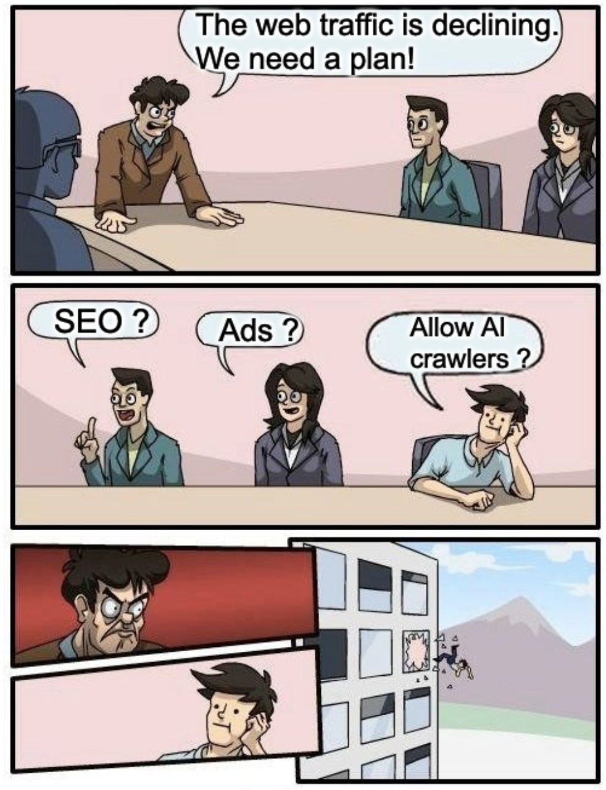

# The Great GPT Firewall 📛

This collection is a curated list of websites that employ the `robots.txt` file to restrict access to AI Agents, AI crawlers and GPTs.

It will be updated monthly.



## User agents & robots.txt

The `robots.txt` file allows website owners to control and limit the access of these user agents to certain areas of their website by specifying rules and directives.

```txt
# OpenAI’s web crawler: GPT3.5, GPT4, ChatGPT
User-agent: GPTBot

# ChatGPT plugins
User-agent: ChatGPT-User

# Google's web crawler: Bard, VertexAI, Gemini
User-agent: Google-Extended

# Claude
User-agent: anthropic-ai

# Common Crawl
User-agent: CCBot

# Omglibot: webz.io
User-agent: Omgilibot
User-agent: Omgili

# ByteDance: Duobao
User-agent: Bytespider

# Censorship area
Disallow: /
```

## Disclaimer

Please note that this blocklist is intended for informational purposes only. Despite the provoking project name, it's fine to disallow web crawling and protect content ownership. 

## 2024-02 update


### Category: Press

- Scanned: 51
- ✅ Passing: 24 %
- 🔐 Blocked: 76 %
- ❓ Unknown: 0 %

| Name                                                            | Country | Status |
| --------------------------------------------------------------- | ------- | ------ |
| [The Times](https://www.thetimes.co.uk)                         | 🇬🇧       | 🔐      |
| [BBC](https://www.bbc.com)                                      | 🇬🇧       | 🔐      |
| [The Guardian](https://www.theguardian.com)                     | 🇬🇧       | 🔐      |
| [The Economist](https://www.economist.com)                      | 🇬🇧       | 🔐      |
| [Financial Times](https://www.ft.com)                           | 🇬🇧       | 🔐      |
| [The Independent](https://www.independent.co.uk)                | 🇬🇧       | ✅      |
| [The Telegraph](https://www.telegraph.co.uk)                    | 🇬🇧       | 🔐      |
| [Daily Mail](https://www.dailymail.co.uk)                       | 🇬🇧       | 🔐      |
| [The Sun](https://www.thesun.co.uk)                             | 🇬🇧       | 🔐      |
| [Daily Mirror](https://www.mirror.co.uk)                        | 🇬🇧       | ✅      |
| [Daily Express](https://www.express.co.uk)                      | 🇬🇧       | ✅      |
| [Washington Post](https://www.washingtonpost.com)               | 🇺🇸       | 🔐      |
| [USA Today](https://www.usatoday.com)                           | 🇺🇸       | ✅      |
| [Fox News](https://www.foxnews.com)                             | 🇺🇸       | ✅      |
| [ABC News](https://abcnews.go.com)                              | 🇺🇸       | 🔐      |
| [NBC News](https://www.nbcnews.com)                             | 🇺🇸       | 🔐      |
| [CBS News](https://www.cbsnews.com)                             | 🇺🇸       | 🔐      |
| [Los Angeles Times](https://www.latimes.com)                    | 🇺🇸       | 🔐      |
| [Chicago Tribune](https://www.chicagotribune.com)               | 🇺🇸       | 🔐      |
| [New York Post](https://nypost.com)                             | 🇺🇸       | 🔐      |
| [New York Daily News](https://www.nydailynews.com)              | 🇺🇸       | 🔐      |
| [The New Yorker](https://www.newyorker.com)                     | 🇺🇸       | 🔐      |
| [Vice](https://www.vice.com)                                    | 🇺🇸       | 🔐      |
| [New York Times](https://www.nytimes.com)                       | 🇺🇸       | 🔐      |
| [Wall Street Journal](https://www.wsj.com)                      | 🇺🇸       | 🔐      |
| [CNN](https://cnn.com)                                          | 🇺🇸       | 🔐      |
| [El País](https://elpais.com)                                   | 🇪🇸       | ✅      |
| [Süddeutsche Zeitung](https://www.sueddeutsche.de)              | 🇩🇪       | 🔐      |
| [Der Spiegel](https://www.spiegel.de)                           | 🇩🇪       | 🔐      |
| [Corriere della Sera](https://www.corriere.it)                  | 🇮🇹       | 🔐      |
| [La Repubblica](https://www.repubblica.it)                      | 🇮🇹       | 🔐      |
| [Le Monde](https://www.lemonde.fr)                              | 🇫🇷       | 🔐      |
| [Libération](https://www.liberation.fr)                         | 🇫🇷       | 🔐      |
| [Le Figaro](https://www.lefigaro.fr)                            | 🇫🇷       | 🔐      |
| [20 Minutes](https://www.20minutes.fr)                          | 🇫🇷       | 🔐      |
| [Ouest France](https://www.ouest-france.fr)                     | 🇫🇷       | 🔐      |
| [Le Parisien](https://www.leparisien.fr)                        | 🇫🇷       | ✅      |
| [L'Equipe](https://www.lequipe.fr)                              | 🇫🇷       | 🔐      |
| [Le Point](https://www.lepoint.fr)                              | 🇫🇷       | 🔐      |
| [Marianne](https://www.marianne.net)                            | 🇫🇷       | 🔐      |
| [Le Nouvel Observateur](https://www.nouvelobs.com)              | 🇫🇷       | 🔐      |
| [L'Express](https://www.lexpress.fr)                            | 🇫🇷       | 🔐      |
| [France 24](https://www.france24.com)                           | 🇫🇷       | 🔐      |
| [BFMTV](https://www.bfmtv.com)                                  | 🇫🇷       | 🔐      |
| [CNews](https://www.cnews.fr)                                   | 🇫🇷       | ✅      |
| [Le Monde Diplomatique](https://www.monde-diplomatique.fr)      | 🇫🇷       | ✅      |
| [Mediapart](https://www.mediapart.fr)                           | 🇫🇷       | 🔐      |
| [Courrier International](https://www.courrierinternational.com) | 🇫🇷       | 🔐      |
| [Brut](https://www.brut.media)                                  | 🇫🇷       | ✅      |
| [IMDB](https://www.imdb.com)                                    | 🌍       | ✅      |
| [Allocine](https://www.allocine.fr)                             | 🇫🇷       | ✅      |

### Category: Video on demand

- Scanned: 9
- ✅ Passing: 56 %
- 🔐 Blocked: 44 %
- ❓ Unknown: 0 %

| Name                                      | Country | Status |
| ----------------------------------------- | ------- | ------ |
| [Prime Video](https://www.primevideo.com) | 🌍       | ✅      |
| [Netflix](https://www.netflix.com)        | 🌍       | ✅      |
| [Disney+](https://www.disneyplus.com)     | 🌍       | 🔐      |
| [Hulu](https://www.hulu.com)              | 🇺🇸       | 🔐      |
| [HBO Max](https://www.max.com)            | 🇺🇸       | ✅      |
| [Canal+](https://www.canalplus.com)       | 🇫🇷       | 🔐      |
| [FranceTV](https://www.france.tv)         | 🇫🇷       | ✅      |
| [TF1](https://www.tf1.fr)                 | 🇫🇷       | 🔐      |
| [6Play](https://www.6play.fr)             | 🇫🇷       | ✅      |

### Category: Music

- Scanned: 6
- ✅ Passing: 67 %
- 🔐 Blocked: 33 %
- ❓ Unknown: 0 %

| Name                                   | Country | Status |
| -------------------------------------- | ------- | ------ |
| [Soundcloud](https://soundcloud.com)   | 🌍       | 🔐      |
| [Youtube](https://www.youtube.com)     | 🌍       | ✅      |
| [Apple Music](https://music.apple.com) | 🌍       | ✅      |
| [Spotify](https://open.spotify.com)    | 🌍       | 🔐      |
| [Deezer](https://www.deezer.com)       | 🇫🇷       | ✅      |
| [LastFM](https://www.last.fm)          | 🇬🇧       | ✅      |

### Category: Podcast

- Scanned: 8
- ✅ Passing: 75 %
- 🔐 Blocked: 25 %
- ❓ Unknown: 0 %

| Name                                                | Country | Status |
| --------------------------------------------------- | ------- | ------ |
| [Google Podcasts](https://play.google.com)          | 🌍       | ✅      |
| [Apple Podcast](https://podcasts.apple.com)         | 🌍       | ✅      |
| [Spotify Podcaster](https://podcasters.spotify.com) | 🌍       | 🔐      |
| [Buzzsprout](https://www.buzzsprout.com)            | 🌍       | ✅      |
| [Podbean](https://watchifyoudare.podbean.com)       | 🌍       | ✅      |
| [Acast](https://www.acast.com)                      | 🇬🇧       | ✅      |
| [AudioMeans](https://podcasts.audiomeans.fr)        | 🇫🇷       | ✅      |
| [Radio France](https://www.radiofrance.fr)          | 🇫🇷       | 🔐      |

### Category: X

- Scanned: 6
- ✅ Passing: 100 %
- 🔐 Blocked: 0 %
- ❓ Unknown: 0 %

| Name                               | Country | Status |
| ---------------------------------- | ------- | ------ |
| [PornHub](https://www.pornhub.com) | 🌍       | ✅      |
| [YouPorn](https://www.youporn.com) | 🌍       | ✅      |
| [Xnxx](https://www.xnxx.com)       | 🌍       | ✅      |
| [Xvideos](https://www.xvideos.com) | 🌍       | ✅      |
| [Xhamster](https://xhamster.com)   | 🌍       | ✅      |
| [OnlyFan](https://onlyfans.com)    | 🌍       | ✅      |

### Category: Religion

- Scanned: 5
- ✅ Passing: 100 %
- 🔐 Blocked: 0 %
- ❓ Unknown: 0 %

| Name                                          | Country | Status |
| --------------------------------------------- | ------- | ------ |
| [Bible](https://www.bible.com)                | 🇺🇸       | ✅      |
| [Bible gateway](https://www.biblegateway.com) | 🇺🇸       | ✅      |
| [Jehovah's Witnesses](https://jw.org)         | 🇺🇸       | ✅      |
| [Vatican](https://www.vatican.va)             | 🇻🇦       | ✅      |
| [Islamweb](https://www.islamweb.net)          | 🌍       | ✅      |

### Category: Social media

- Scanned: 11
- ✅ Passing: 55 %
- 🔐 Blocked: 45 %
- ❓ Unknown: 0 %

| Name                                       | Country | Status |
| ------------------------------------------ | ------- | ------ |
| [Facebook](https://www.facebook.com)       | 🌍       | 🔐      |
| [Instagram](https://www.instagram.com)     | 🌍       | 🔐      |
| [Reddit](https://www.reddit.com)           | 🌍       | ✅      |
| [Pinterest](https://www.pinterest.com)     | 🌍       | 🔐      |
| [TikTok](https://www.tiktok.com)           | 🌍       | ✅      |
| [Twitter](https://twitter.com)             | 🌍       | ✅      |
| [LinkedIn](https://linkedin.com)           | 🌍       | ✅      |
| [Quora](https://quora.com)                 | 🌍       | 🔐      |
| [VK](https://vk.com)                       | 🇷🇺       | ✅      |
| [TripAdvisor](https://www.tripadvisor.com) | 🌍       | ✅      |
| [Yelp](https://www.yelp.com)               | 🌍       | 🔐      |

### Category: Artist

- Scanned: 42
- ✅ Passing: 74 %
- 🔐 Blocked: 21 %
- ❓ Unknown: 0 %

| Name                                                                 | Country | Status |
| -------------------------------------------------------------------- | ------- | ------ |
| [Michael Jackson](https://www.michaeljackson.com)                    | 🇺🇸       | ✅      |
| [Madonna](https://www.madonna.com)                                   | 🇺🇸       | ✅      |
| [Taylor Swift](https://www.taylorswift.com)                          | 🇺🇸       | 🔐      |
| [Rihanna](https://www.rihanna.com)                                   | 🇺🇸       | ✅      |
| [Bruno Mars](https://www.brunomars.com)                              | 🇺🇸       | ✅      |
| [Justin Bieber](https://www.justinbiebermusic.com)                   | 🇺🇸       | 🔐      |
| [Beyoncé](https://www.beyonce.com)                                   | 🇺🇸       | ✅      |
| [Katy Perry](https://www.katyperry.com)                              | 🇺🇸       | 🔐      |
| [Lady Gaga](https://www.ladygaga.com)                                | 🇺🇸       | 🔐      |
| [Hardwell](https://www.djhardwell.com)                               | 🇺🇸       | ✅      |
| [Dimitri Vegas & Like Mike](https://www.dimitrivegasandlikemike.com) | 🇺🇸       | ✅      |
| [Kanye West](https://www.kanyewest.com)                              | 🇺🇸       | ❓      |
| [Black Eyed Peas](https://www.blackeyedpeas.com)                     | 🇺🇸       | ✅      |
| [Imagine Dragons](https://www.imaginedragonsmusic.com)               | 🇺🇸       | 🔐      |
| [Twenty One Pilots](https://www.twentyonepilots.com)                 | 🇺🇸       | ✅      |
| [Maroon 5](https://www.maroon5.com)                                  | 🇺🇸       | 🔐      |
| [Selena Gomez](https://www.selenagomez.com)                          | 🇺🇸       | 🔐      |
| [Usher](https://www.usherworld.com)                                  | 🇺🇸       | 🔐      |
| [Stromae](https://www.stromae.com)                                   | 🇧🇪       | ✅      |
| [Aya Nakamura](https://www.ayanakamura.fr)                           | 🇫🇷       | ❓      |
| [Soprano](https://www.soprano-lesite.fr)                             | 🇫🇷       | ✅      |
| [Johnny Hallyday](https://www.johnnyhallyday.com)                    | 🇫🇷       | ✅      |
| [Grand Corps Malade](https://www.grandcorpsmalade.fr)                | 🇫🇷       | ✅      |
| [Zaho](https://zahomusic.com)                                        | 🇫🇷       | ✅      |
| [Jean Louis Aubert](https://www.jeanlouisaubert.com)                 | 🇫🇷       | ✅      |
| [Camelia Jordana](https://www.cameliajordana.com)                    | 🇫🇷       | ✅      |
| [Indochine](https://indo.fr)                                         | 🇫🇷       | ✅      |
| [Tryo](https://tryo.com)                                             | 🇫🇷       | ✅      |
| [David Guetta](https://davidguetta.com)                              | 🇫🇷       | ✅      |
| [Mc Solaar](https://www.mcsolaar.com)                                | 🇫🇷       | ✅      |
| [Zaz](https://www.zazofficial.com)                                   | 🇫🇷       | ✅      |
| [Christine and the Queens](https://www.christineandthequeens.com)    | 🇫🇷       | ✅      |
| [Boulevard des Airs](https://bda-boulevarddesairs.com)               | 🇫🇷       | ✅      |
| [Calogero](https://calogero.fr)                                      | 🇫🇷       | ✅      |
| [Hoshi](https://www.hoshimusic-store.com)                            | 🇫🇷       | ✅      |
| [Avicii](https://avicii.com)                                         | 🇸🇪       | ✅      |
| [Adele](https://www.adele.com)                                       | 🇬🇧       | ✅      |
| [Calvin Harris](https://calvinharris.com)                            | 🇬🇧       | ✅      |
| [Ed Sheeran](https://www.edsheeran.com)                              | 🇬🇧       | ✅      |
| [Arctic Monkeys](https://arcticmonkeys.com)                          | 🇬🇧       | ✅      |
| [Coldplay](https://www.coldplay.com)                                 | 🇬🇧       | ✅      |
| [The Weeknd](https://www.theweeknd.com)                              | 🇨🇦       | 🔐      |

### Category: Gov

- Scanned: 3
- ✅ Passing: 100 %
- 🔐 Blocked: 0 %
- ❓ Unknown: 0 %

| Name                                      | Country | Status |
| ----------------------------------------- | ------- | ------ |
| [White House](https://www.whitehouse.gov) | 🇺🇸       | ✅      |
| [Elysée](https://www.elysee.fr)           | 🇫🇷       | ✅      |
| [Europe](https://www.europa.eu)           | 🇪🇺       | ✅      |

### Category: Science

- Scanned: 28
- ✅ Passing: 86 %
- 🔐 Blocked: 14 %
- ❓ Unknown: 0 %

| Name                                                    | Country | Status |
| ------------------------------------------------------- | ------- | ------ |
| [Google Scholar](https://scholar.google.com)            | 🌍       | ✅      |
| [Sci-Hub](https://sci-hub.se)                           | 🌍       | ✅      |
| [PubPeer](https://pubpeer.com)                          | 🌍       | ✅      |
| [Scopus](https://www.scopus.com)                        | 🇳🇱       | 🔐      |
| [Elsevier](https://www.elsevier.com)                    | 🇳🇱       | 🔐      |
| [ScienceDirect](https://www.sciencedirect.com)          | 🇳🇱       | 🔐      |
| [MDPI](https://www.mdpi.com)                            | 🇨🇭       | ✅      |
| [Springer](https://www.springer.com)                    | 🇩🇪       | ✅      |
| [Wiley](https://www.wiley.com)                          | 🇺🇸       | ✅      |
| [American Chemical Society](https://www.acs.org)        | 🇺🇸       | ✅      |
| [PubMed](https://pubmed.ncbi.nlm.nih.gov)               | 🇺🇸       | ✅      |
| [Academia](https://www.academia.edu)                    | 🇺🇸       | ✅      |
| [Science](https://www.science.org)                      | 🇺🇸       | 🔐      |
| [ArXiv](https://arxiv.org)                              | 🇺🇸       | ✅      |
| [American Physical Society](https://www.aps.org)        | 🇺🇸       | ✅      |
| [Mendeley](https://www.mendeley.com)                    | 🇬🇧       | ✅      |
| [Nature](https://www.nature.com)                        | 🇬🇧       | ✅      |
| [Taylor & Francis](https://www.taylorandfrancis.com)    | 🇬🇧       | ✅      |
| [Oxford University Press](https://www.oup.com)          | 🇬🇧       | ✅      |
| [Cambridge University Press](https://www.cambridge.org) | 🇬🇧       | ✅      |
| [Royal Society of Chemistry](https://www.rsc.org)       | 🇬🇧       | ✅      |
| [ResearchGate](https://www.researchgate.net)            | 🇩🇪       | ✅      |
| [BNF](https://www.bnf.fr)                               | 🇫🇷       | ✅      |
| [Cairn](https://www.cairn.info)                         | 🇫🇷       | ✅      |
| [Persee](https://www.persee.fr)                         | 🇫🇷       | ✅      |
| [Gallica](https://gallica.bnf.fr)                       | 🇫🇷       | ✅      |
| [HAL](https://hal.archives-ouvertes.fr)                 | 🇫🇷       | ✅      |
| [OpenEdition](https://www.openedition.org)              | 🇫🇷       | ✅      |

### Category: Dev

- Scanned: 3
- ✅ Passing: 67 %
- 🔐 Blocked: 33 %
- ❓ Unknown: 0 %

| Name                                        | Country | Status |
| ------------------------------------------- | ------- | ------ |
| [Github](https://github.com)                | 🌍       | ✅      |
| [Gitlab](https://gitlab.com)                | 🌍       | ✅      |
| [Stack Overflow](https://stackoverflow.com) | 🌍       | 🔐      |

### Category: Other content

- Scanned: 19
- ✅ Passing: 84 %
- 🔐 Blocked: 16 %
- ❓ Unknown: 0 %

| Name                                         | Country | Status |
| -------------------------------------------- | ------- | ------ |
| [Wikipedia](https://www.wikipedia.org)       | 🌍       | ✅      |
| [Medium](https://medium.com)                 | 🌍       | 🔐      |
| [Substack](https://www.substack.com)         | 🌍       | ✅      |
| [Common Crawl](https://commoncrawl.org)      | 🌍       | ✅      |
| [Internet Archive](https://archive.org)      | 🌍       | ✅      |
| [Wayback Machine](https://web.archive.org)   | 🌍       | ✅      |
| [Notion](https://www.notion.so)              | 🌍       | ✅      |
| [Weather](https://www.weather.com)           | 🇺🇸       | 🔐      |
| [AccuWeather](https://www.accuweather.com)   | 🇺🇸       | ✅      |
| [Météo France](https://www.meteofrance.com)  | 🇫🇷       | ✅      |
| [Getty Images](https://www.gettyimages.com)  | 🇺🇸       | ✅      |
| [Shutterstock](https://www.shutterstock.com) | 🇺🇸       | 🔐      |
| [Adobe Stock](https://stock.adobe.com)       | 🇺🇸       | ✅      |
| [Unsplash](https://unsplash.com)             | 🇨🇦       | ✅      |
| [Pexels](https://www.pexels.com)             | 🇩🇪       | ✅      |
| [Pixabay](https://www.pixabay.com)           | 🇩🇪       | ✅      |
| [Flickr](https://www.flickr.com)             | 🇺🇸       | ✅      |
| [500px](https://500px.com)                   | 🇨🇦       | ✅      |
| [Giphy](https://giphy.com)                   | 🇺🇸       | ✅      |

### Category: Other

- Scanned: 1
- ✅ Passing: 100 %
- 🔐 Blocked: 0 %
- ❓ Unknown: 0 %

| Name                             | Country | Status |
| -------------------------------- | ------- | ------ |
| [Indeed](https://www.indeed.com) | 🇺🇸       | ✅      |


## WTF list

A.k.a: do they understand their business model? 💸

| Name                                        | Status |
| ------------------------------------------- | ------ |
| [Adobe Stock](https://stock.adobe.com)      | ✅      |
| [Getty Images](https://www.gettyimages.com) | ✅      |
| [Pexels](https://www.pexels.com)            | ✅      |
| [Pixabay](https://www.pixabay.com)          | ✅      |
| [500px](https://500px.com)                  | ✅      |

## Shame list 

A.k.a: this is public interest. 🖕

| Name                                           | Status |
| ---------------------------------------------- | ------ |
| [Medium](https://medium.com)                   | 🔐      |
| [Quora](https://quora.com)                     | 🔐      |
| [Elsevier](https://www.elsevier.com)           | 🔐      |
| [ScienceDirect](https://www.sciencedirect.com) | 🔐      |
| [Scopus](https://www.scopus.com)               | 🔐      |
| [Science](https://www.science.org)             | 🔐      |

## 🤝 Contributing

Looking for contributions:
- Enrich website database
- Chinese websites
- New categories

Please open issues!

- Ping me on Twitter [@samuelberthe](https://twitter.com/samuelberthe) (DMs, mentions, whatever :))
- Fork the [project](https://github.com/samber/the-great-gpt-firewall)
- Fix [open issues](https://github.com/samber/the-great-gpt-firewall/issues) or request new features

Don't hesitate ;)

### Build

```bash
pip3 install -r requirements.txt
python3 scrape.py
# then copy the last version into readme
```

## 👤 Contributors


## 💫 Show your support

Give a ⭐️ if this project helped you!

[](https://github.com/sponsors/samber)

## 📝 License

Copyright © 2024 [Samuel Berthe](https://github.com/samber).

This project is [MIT](./LICENSE) licensed.
